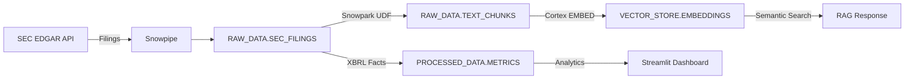

# 🤖 AI-Powered Enterprise Data Assistant (RAG + Cortex)

[](https://innoe257-ai-powered-enterprise-data-assistant.streamlit.app)
[](https://www.python.org/downloads/)
[](https://www.snowflake.com/)
[](https://opensource.org/licenses/MIT)

[](https://innoe257-snowflake-financial-rag.streamlit.app)
[](https://www.python.org/downloads/)
[](https://www.snowflake.com/)
[](https://opensource.org/licenses/MIT)

> **Enterprise-grade Financial Document Analysis powered by Snowflake AI**

An end-to-end Retrieval-Augmented Generation (RAG) system for analyzing SEC financial filings, built entirely on Snowflake with a Streamlit frontend. Designed to showcase production data engineering and AI/ML skills to potential employers.


---

## 🎯 What This Project Demonstrates

| Skill | Implementation |
|-------|---------------|
| **Snowflake Architecture** | Warehouses, Dynamic Tables, Streams, Tasks, Search Optimization |
| **Cortex AI** | `EMBED_TEXT_768`, `COMPLETE`, Vector Search, Semantic Search UDFs |
| **Snowpark Python** | UDFs, Stored Procedures, DataFrames, Session management |
| **Data Engineering** | ETL pipelines, chunking, embedding generation, incremental processing |
| **Streamlit** | Production web app with chat interface, dashboards, document viewer |
| **SEC EDGAR** | Real regulatory data ingestion, XBRL parsing, financial metrics |
| **Vector DB** | FAISS / Snowflake VECTOR type for semantic search |
| **CI/CD** | GitHub Actions for automated testing and deployment |

---

## 🏗️ Architecture

```
┌─────────────────────────────────────────────────────────────────────────┐
│                         LAYER 1: DATA INGESTION                          │
│  SEC EDGAR API ──► Snowpipe ──► RAW_DATA.SEC_FILINGS                    │
│  HTML/PDF docs ──► Snowpark UDF (chunk) ──► RAW_DATA.TEXT_CHUNKS        │
├─────────────────────────────────────────────────────────────────────────┤
│                         LAYER 2: EMBEDDING PIPELINE                      │
│  Cortex EMBED_TEXT_768 ──► VECTOR_STORE.DOCUMENT_EMBEDDINGS             │
│  Dynamic Tables ──► Incremental updates                                 │
├─────────────────────────────────────────────────────────────────────────┤
│                         LAYER 3: RAG INTERFACE                           │
│  User Query ──► SEMANTIC_SEARCH() ──► Top-K Chunks                      │
│  Context + Query ──► Cortex COMPLETE ──► AI Response                    │
├─────────────────────────────────────────────────────────────────────────┤
│                         LAYER 4: FRONTEND                                │
│  Streamlit App: Chat │ Dashboard │ Document Viewer                      │
│  Dual Mode: Demo (local) │ Snowflake (production)                       │
└─────────────────────────────────────────────────────────────────────────┘
```

---

## 🚀 Live Demo

**🔗 [Launch Streamlit App](https://your-app-url.streamlit.app)**

The demo mode uses pre-loaded SEC filings from major tech companies:
- Apple (AAPL)
- Microsoft (MSFT)
- Alphabet/Google (GOOGL)
- Amazon (AMZN)
- NVIDIA (NVDA)
- Tesla (TSLA)

### Features

- **💬 RAG Chat** — Ask natural language questions about financial data
- **📈 Financial Dashboard** — Interactive charts and key metrics
- **📄 Document Viewer** — Browse and search SEC filings

---

## 🛠️ Local Setup

### Prerequisites

- Python 3.11+
- Snowflake account (optional for demo mode)
- Git

### Installation

```bash
# Clone the repo
git clone https://github.com/innoe257/ai-powered-enterprise-data-assistant.git
cd ai-powered-enterprise-data-assistant
cd snowflake-financial-rag

# Create virtual environment
python -m venv venv
source venv/bin/activate  # On Windows: venv\Scripts\activate

# Install dependencies
pip install -r requirements.txt

# Configure environment
cp .env.example .env
# Edit .env with your Snowflake credentials (optional for demo)

# Run the app
streamlit run app/main.py
```

The app will start at `http://localhost:8501`

---

## ❄️ Snowflake Setup

### 1. Run Database Setup SQL

```bash
# Connect to Snowflake and run setup script
snowsql -f snowflake/sql/01_setup_database.sql
```

This creates:
- Warehouses (`FINANCIAL_RAG_WH`, `FINANCIAL_RAG_COMPUTE_WH`)
- Database (`FINANCIAL_RAG`) with schemas
- Tables, stages, dynamic tables
- Access roles and permissions

### 2. Run Cortex AI Integration

```bash
snowsql -f snowflake/sql/02_cortex_ai.sql
```

This sets up:
- `CORTEX_EMBED_TEXT()` — Generate embeddings
- `CORTEX_RAG_RESPONSE()` — Generate AI responses
- `SEMANTIC_SEARCH()` — Vector similarity search
- `RAG_QUERY()` — End-to-end RAG pipeline
- Scheduled tasks for incremental processing

### 3. Configure App for Snowflake Mode

Edit `.env`:

```env
APP_MODE=snowflake
SNOWFLAKE_ACCOUNT=your_account
SNOWFLAKE_USER=your_username
SNOWFLAKE_PASSWORD=your_password
SNOWFLAKE_ROLE=FINANCIAL_RAG_ROLE
SNOWFLAKE_WAREHOUSE=FINANCIAL_RAG_WH
SNOWFLAKE_DATABASE=FINANCIAL_RAG
```

---

## 📁 Project Structure

```
ai-powered-enterprise-data-assistant/
├── app/                          # Streamlit application
│   ├── main.py                   # Entry point
│   ├── components/               # UI components
│   │   ├── chat.py              # RAG chat interface
│   │   ├── dashboard.py         # Financial dashboards
│   │   └── document_viewer.py   # SEC filing browser
│   └── utils/                    # Utilities
│       ├── data_loader.py       # Data loading
│       ├── embeddings.py        # Search & RAG logic
│       └── config.py            # Configuration
├── snowflake/                    # Snowflake artifacts
│   ├── sql/                      # SQL scripts
│   │   ├── 01_setup_database.sql
│   │   └── 02_cortex_ai.sql
│   └── python/                   # Snowpark Python
│       ├── document_processor.py
│       └── generate_embeddings.py
├── data/                         # Data files (gitignored)
│   ├── filings/                  # SEC filings
│   └── embeddings/              # Pre-computed vectors
├── docs/                         # Documentation
├── tests/                        # Unit tests
├── .github/workflows/            # CI/CD
├── requirements.txt              # Python dependencies
├── .env.example                  # Environment template
└── README.md                     # This file
```

---

## 💡 Example Queries

Try these in the RAG Chat:

- "Compare revenue growth between Apple and Microsoft"
- "What are NVIDIA's main risk factors?"
- "Summarize Tesla's latest quarterly performance"
- "How does Amazon's free cash flow compare to Alphabet?"
- "What AI-related investments are mentioned across all filings?"

---

## 🔧 Technologies Used

| Layer | Technology |
|-------|-----------|
| **Database** | Snowflake (Cortex AI, Snowpark, Dynamic Tables) |
| **Backend** | Python 3.11, Snowflake Connector |
| **Frontend** | Streamlit, Plotly |
| **Embeddings** | Snowflake Cortex EMBED_TEXT_768 / sentence-transformers |
| **Vector Search** | FAISS / Snowflake VECTOR type |
| **Data Source** | SEC EDGAR API |
| **CI/CD** | GitHub Actions |
| **Hosting** | Streamlit Community Cloud |

---

## 📊 Data Pipeline



---

## 🧪 Testing

```bash
# Run unit tests
pytest tests/ -v

# Run with coverage
pytest tests/ --cov=app --cov-report=html
```

---

## 🚢 Deployment

### Streamlit Cloud (Free)

1. Fork this repo to your GitHub account
2. Go to [share.streamlit.io](https://share.streamlit.io)
3. Connect your GitHub account
4. Select this repo and deploy

### Snowflake Production

1. Run all SQL scripts in `snowflake/sql/`
2. Upload filing documents to `@RAW_DATA.SEC_FILINGS_STAGE`
3. Execute stored procedures to process chunks and embeddings
4. Configure app with Snowflake credentials

---

## 📝 License

MIT License - see [LICENSE](LICENSE) for details.

---

## 👤 Author

**Innocent Mamvura**

- LinkedIn: [linkedin.com/in/innocentmamvura](https://linkedin.com/in/innocentmamvura)
- GitHub: [@innoe257](https://github.com/innoe257)
- Role: Lead Data Scientist | AI/ML & GenAI

---

## 🙏 Acknowledgments

- [SEC EDGAR](https://www.sec.gov/edgar) for public financial data
- [Snowflake](https://www.snowflake.com/) for Cortex AI and Snowpark
- [Streamlit](https://streamlit.io/) for the amazing web framework

---

> **Note to Recruiters:** This project demonstrates production-grade data engineering skills including ETL pipelines, vector databases, LLM integration, and cloud architecture. The full Snowflake backend can be deployed on any Snowflake account using the provided SQL scripts.
