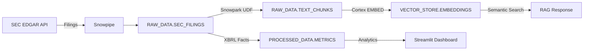

# 🤖 AI-Powered Enterprise Data Assistant (RAG + Cortex)

[](https://innoe257-ai-powered-enterprise-data-assistant.streamlit.app)
[](https://www.python.org/downloads/)
[](https://www.snowflake.com/)
[](https://opensource.org/licenses/MIT)

> **Enterprise-grade Financial Document Analysis powered by Snowflake AI**

An end-to-end Retrieval-Augmented Generation (RAG) system for analyzing SEC financial filings, built with Snowflake + Streamlit + Claude AI. Designed to showcase production data engineering and AI/ML skills to potential employers.


---

## 🎯 What This Project Demonstrates

| Skill | Implementation |
|-------|---------------|
| **Snowflake Architecture** | Warehouses, Dynamic Tables, Streams, Tasks, Search Optimization |
| **Cortex AI** | `EMBED_TEXT_768`, Vector Search, Semantic Search UDFs |
| **Claude AI** | Anthropic API for intelligent RAG responses (Snowflake Cortex alternative) |
| **Snowpark Python** | UDFs, Stored Procedures, DataFrames, Session management |
| **Data Engineering** | ETL pipelines, chunking, embedding generation, incremental processing |
| **Streamlit** | Production web app with chat interface, dashboards, document viewer |
| **SEC EDGAR** | Real regulatory data ingestion, XBRL parsing, financial metrics |
| **Vector DB** | FAISS / Snowflake VECTOR type for semantic search |
| **CI/CD** | GitHub Actions for automated testing and deployment |

---

## 🏗️ Architecture

```
┌─────────────────────────────────────────────────────────────────────────┐
│                         LAYER 1: DATA INGESTION                          │
│  SEC EDGAR API ──► Snowpipe ──► RAW_DATA.SEC_FILINGS                    │
│  HTML/PDF docs ──► Snowpark UDF (chunk) ──► RAW_DATA.TEXT_CHUNKS        │
├─────────────────────────────────────────────────────────────────────────┤
│                         LAYER 2: EMBEDDING PIPELINE                      │
│  Cortex EMBED_TEXT_768 ──► VECTOR_STORE.DOCUMENT_EMBEDDINGS             │
│  Dynamic Tables ──► Incremental updates                                 │
├─────────────────────────────────────────────────────────────────────────┤
│                         LAYER 3: RAG INTERFACE                           │
│  User Query ──► SEMANTIC_SEARCH() ──► Top-K Chunks                      │
│  Context + Query ──► Claude API ──► AI Response                         │
├─────────────────────────────────────────────────────────────────────────┤
│                         LAYER 4: FRONTEND                                │
│  Streamlit App: Chat │ Dashboard │ Document Viewer                      │
│  Dual Mode: Demo (local) │ Snowflake (production)                       │
└─────────────────────────────────────────────────────────────────────────┘
```

---

## 🚀 Live Demo

**🔗 [Launch Streamlit App](https://innoe257-ai-powered-enterprise-data-assistant.streamlit.app)**

The demo mode uses pre-loaded SEC filings from major tech companies:
- Apple (AAPL)
- Microsoft (MSFT)
- Alphabet/Google (GOOGL)
- Amazon (AMZN)
- NVIDIA (NVDA)
- Tesla (TSLA)

### Features

- **💬 RAG Chat** — Ask natural language questions about financial data
- **📈 Financial Dashboard** — Interactive charts and key metrics
- **📄 Document Viewer** — Browse and search SEC filings

---

## 🛠️ Local Setup

### Prerequisites

- Python 3.11+
- Snowflake account (optional for demo mode)
- Git

### Installation

```bash
# Clone the repo
git clone https://github.com/innoe257/ai-powered-enterprise-data-assistant.git
cd ai-powered-enterprise-data-assistant

# Create virtual environment
python -m venv venv
source venv/bin/activate  # On Windows: venv\Scripts\activate

# Install dependencies
pip install -r requirements.txt

# Configure environment
cp .env.example .env
# Edit .env with your credentials (Snowflake optional for demo, Claude API key for AI responses)

# Run the app
streamlit run app/main.py
```

The app will start at `http://localhost:8501`

---

## ❄️ Snowflake Setup

### Prerequisites

- A Snowflake account (trial or paid)
- `snowsql` CLI or Snowflake Web UI access
- Python with `snowflake-connector-python` installed

### Step 1: Configure Credentials

Copy `.env.example` to `.env` and add your Snowflake credentials:

```bash
cp .env.example .env
```

Edit `.env`:
```env
SNOWFLAKE_ACCOUNT=your_account_identifier
SNOWFLAKE_USER=your_username
SNOWFLAKE_PASSWORD=your_password
SNOWFLAKE_ROLE=ACCOUNTADMIN
SNOWFLAKE_WAREHOUSE=FINANCIAL_RAG_WH
SNOWFLAKE_DATABASE=FINANCIAL_RAG
SNOWFLAKE_SCHEMA=PUBLIC
APP_MODE=snowflake
CLAUDE_API_KEY=your_claude_api_key
```

### Step 2: Create Database & Tables

Connect to Snowflake and run the setup script:

```bash
# Using SnowSQL CLI
snowsql -a YOUR_ACCOUNT -u YOUR_USER -f snowflake/sql/01_setup_database.sql

# Or copy/paste into Snowflake Web UI (Worksheets)
```

This creates:
- **Warehouses**: `FINANCIAL_RAG_WH` (XS), `FINANCIAL_RAG_COMPUTE_WH` (S)
- **Database**: `FINANCIAL_RAG` with 4 schemas
- **Tables**: `SEC_FILINGS`, `TEXT_CHUNKS`, `DOCUMENT_EMBEDDINGS`, `FINANCIAL_METRICS`, `COMPANY_INFO`
- **Dynamic Tables**: Auto-updating analytics views
- **Roles & Permissions**: `FINANCIAL_RAG_ROLE`
- **Search Optimization**: On key lookup columns

### Step 3: Choose Your Backend SQL

#### Option A — Trial Accounts (No Cortex AI)

Trial accounts don't have access to Snowflake Cortex AI (`EMBED_TEXT_768`, `COMPLETE`). Use this option:

```bash
snowsql -a YOUR_ACCOUNT -u YOUR_USER -f snowflake/sql/02_trial_backend.sql
```

This creates:
- `KEYWORD_SEARCH()` — Text search function (no vector similarity)
- `GET_COMPANY_METRICS()` — Financial metrics aggregation
- `LOG_SEARCH()` — Search analytics logging
- Analytics views: `VW_FILING_OVERVIEW`, `VW_METRICS_COMPARISON`

The app uses **Claude API** for AI responses instead of Cortex.

#### Option B — Paid Accounts (Full Cortex AI)

If you have a paid Snowflake account with Cortex AI enabled:

```bash
snowsql -a YOUR_ACCOUNT -u YOUR_USER -f snowflake/sql/02_cortex_ai.sql
```

This creates:
- `CORTEX_EMBED_TEXT()` — Generate 768-dim embeddings
- `CORTEX_RAG_RESPONSE()` — AI response generation
- `SEMANTIC_SEARCH()` — Vector similarity search
- `RAG_QUERY()` — End-to-end RAG stored procedure
- Scheduled Tasks for daily processing

### Step 4: Load Demo Data into Snowflake

After downloading SEC filings locally, load them into Snowflake:

```bash
# Test connection first
python snowflake/python/setup_connection.py

# Load all demo data (filings, chunks, metrics, company info)
python snowflake/python/load_demo_data.py
```

This populates:
- `RAW_DATA.SEC_FILINGS` — Filing metadata
- `RAW_DATA.TEXT_CHUNKS` — Document chunks for search
- `PROCESSED_DATA.FINANCIAL_METRICS` — XBRL financial data
- `PROCESSED_DATA.COMPANY_INFO` — Company dimension

### Step 5: Run the App in Snowflake Mode

```bash
# Ensure APP_MODE=snowflake in .env
streamlit run app/main.py
```

The app will now query Snowflake for all data instead of local files.

---

## 📁 Project Structure

```
ai-powered-enterprise-data-assistant/
├── app/                          # Streamlit application
│   ├── main.py                   # Entry point (dual mode: demo/snowflake)
│   ├── components/               # UI components
│   │   ├── chat.py              # RAG chat interface
│   │   ├── dashboard.py         # Financial dashboards
│   │   └── document_viewer.py   # SEC filing browser
│   └── utils/                    # Utilities
│       ├── data_loader.py       # Data loading (demo + Snowflake)
│       ├── embeddings.py        # Search & RAG logic (Claude + fallback)
│       └── config.py            # Configuration
├── snowflake/                    # Snowflake artifacts
│   ├── sql/                      # SQL scripts
│   │   ├── 01_setup_database.sql # Database, tables, warehouses, roles
│   │   ├── 02_trial_backend.sql  # Trial-compatible functions (NO Cortex)
│   │   └── 02_cortex_ai.sql     # Full Cortex AI (paid accounts only)
│   └── python/                   # Snowpark Python
│       ├── setup_connection.py  # Connection test
│       ├── load_demo_data.py    # Load SEC data into Snowflake
│       ├── document_processor.py # Chunking & cleaning UDFs
│       └── generate_embeddings.py # Local embedding generation
├── data/                         # Data files (gitignored)
│   ├── filings/                  # SEC filings
│   └── embeddings/              # Pre-computed vectors
├── docs/                         # Documentation
├── tests/                        # Unit tests
├── .github/workflows/            # CI/CD
├── requirements.txt              # Python dependencies
├── .env.example                  # Environment template
└── README.md                     # This file
```

---

## 💡 Example Queries

Try these in the RAG Chat:

- "Compare revenue growth between Apple and Microsoft"
- "What are NVIDIA's main risk factors?"
- "Summarize Tesla's latest quarterly performance"
- "How does Amazon's free cash flow compare to Alphabet?"
- "What AI-related investments are mentioned across all filings?"

---

## 🔧 Technologies Used

| Layer | Technology |
|-------|-----------|
| **Database** | Snowflake (Cortex AI, Snowpark, Dynamic Tables) |
| **Backend** | Python 3.11, Snowflake Connector |
| **Frontend** | Streamlit, Plotly |
| **AI / LLM** | Snowflake Cortex (production) / Claude API (demo) |
| **Vector Search** | FAISS / Snowflake VECTOR type |
| **Data Source** | SEC EDGAR API |
| **CI/CD** | GitHub Actions |
| **Hosting** | Streamlit Community Cloud |

---

## 📊 Data Pipeline



---

## 🧪 Testing

```bash
# Run unit tests
pytest tests/ -v

# Run with coverage
pytest tests/ --cov=app --cov-report=html
```

---

## 🚢 Deployment

### Streamlit Cloud (Free)

1. Fork this repo to your GitHub account
2. Go to [share.streamlit.io](https://share.streamlit.io)
3. Connect your GitHub account
4. Select this repo and deploy
5. **Add your Claude API key:** Go to app Settings → Secrets, then add:
   ```toml
   CLAUDE_API_KEY = "sk-ant-api03-your-key-here"
   ```
   *(Without this, the app works in demo mode with rule-based responses)*

### Snowflake Production

1. Run all SQL scripts in `snowflake/sql/`
2. Load demo data: `python snowflake/python/load_demo_data.py`
3. Configure app with Snowflake credentials in `.env`
4. Set `APP_MODE=snowflake`
5. Deploy to Streamlit Cloud or run locally

---

## 📝 License

MIT License - see [LICENSE](LICENSE) for details.

---

## 👤 Author

**Innocent Mamvura**

- LinkedIn: [linkedin.com/in/innocentmamvura](https://linkedin.com/in/innocentmamvura)
- GitHub: [@innoe257](https://github.com/innoe257)
- Role: Lead Data Scientist | AI/ML & GenAI

---

## 🙏 Acknowledgments

- [SEC EDGAR](https://www.sec.gov/edgar) for public financial data
- [Snowflake](https://www.snowflake.com/) for Cortex AI and Snowpark
- [Streamlit](https://streamlit.io/) for the amazing web framework

---

> **Note to Recruiters:** This project demonstrates production-grade data engineering skills including ETL pipelines, vector databases, LLM integration, and cloud architecture. The full Snowflake backend can be deployed on any Snowflake account using the provided SQL scripts.
